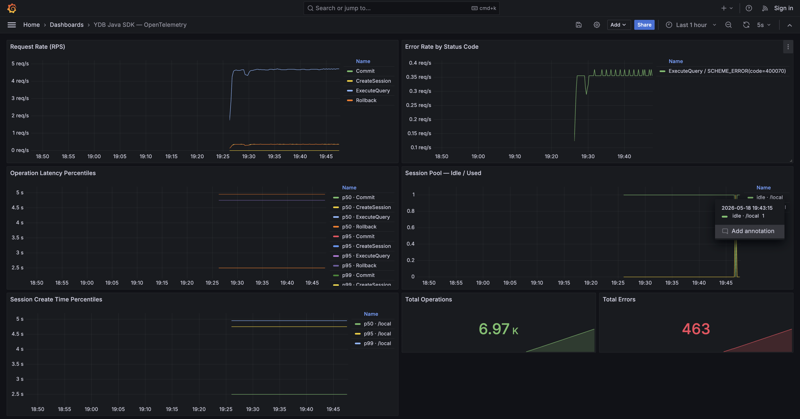
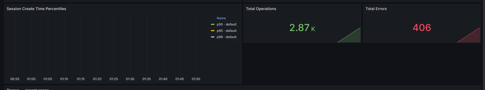

# YDB Java SDK — OpenTelemetry Examples

Демонстрационное приложение, показывающее интеграцию [ydb-java-sdk](https://github.com/ydb-platform/ydb-java-sdk)
с OpenTelemetry: метрики пула сессий и клиентских операций экспортируются в Prometheus/Grafana,
трейсы — в Jaeger.

## Архитектура

```
YDB Java SDK
  ├── OpenTelemetryMeter   → метрики операций и пула сессий
  └── OpenTelemetryTracer  → трейсы ExecuteQuery / Commit / Rollback / Retry

        │ OTLP gRPC (:4317)
        ▼
  OTel Collector
    ├── prometheus exporter (:9464) ← Prometheus ← Grafana
    └── otlp exporter → Jaeger (:4317)     ← Grafana
```

## Метрики

| Метрика | Тип | Описание |
|---|---|---|
| `ydb.client.operation.duration` | Histogram | Длительность клиентских операций |
| `ydb.client.operation.failed` | Counter | Число завершившихся с ошибкой операций |
| `ydb.client.retry.duration` | Histogram | Длительность retry-попыток |
| `ydb.client.retry.attempts` | Histogram | Число попыток за один retry-вызов |
| `ydb.query.session.count` | Gauge | Текущее число сессий в пуле (idle / used) |
| `ydb.query.session.min` | Gauge | Минимальный размер пула |
| `ydb.query.session.max` | Gauge | Максимальный размер пула |
| `ydb.query.session.create_time` | Histogram | Время создания новой сессии |
| `ydb.query.session.pending_requests` | Counter | Запросы, ожидающие свободной сессии |
| `ydb.query.session.timeouts` | Counter | Тайм-ауты ожидания сессии |

Атрибуты метрик: `database`, `endpoint`, `operation.name`, `ydb.query.session.state`, `ydb.query.session.pool.name`.

## Трейсы

| Span | Когда создаётся |
|---|---|
| `ydb.ExecuteQuery` | Любой SELECT / DML запрос |
| `ydb.Commit` | Явный коммит транзакции |
| `ydb.Rollback` | Откат транзакции |
| `ydb.CreateSession` | Создание новой сессии в пуле |
| `ydb.RunWithRetry` | Вызов через `SessionRetryContext` |
| `ydb.Try` | Одна попытка внутри `RunWithRetry` (дочерний span) |

Атрибуты ошибочных span-ов: `db.response.status_code`, `error.type`.

## Схема базы данных

```
Groups    (GroupId, GroupName)
Students  (StudentId, StudentName, GroupId)
Courses   (CourseId, CourseName)
Lecturers (LecturerId, LecturerName)
Plan      (GroupId, CourseId, LecturerId)
Marks     (StudentId, CourseId, Mark)
```

## Быстрый старт

### 1. Собрать локальный снепшот SDK

```bash
git clone https://github.com/ydb-platform/ydb-java-sdk
cd ydb-java-sdk
mvn install -DskipTests
```

### 2. Поднять инфраструктуру

```bash
cd ../ydb-java-otel-examples
docker compose up -d
```

Проверить статус (ожидается 5 сервисов):

```bash
docker compose ps
```

```
ydb-local        Up (healthy)
otel-collector   Up
prometheus       Up
jaeger           Up
grafana          Up
```

### 3. Собрать и запустить

```bash
mvn package -q
java -jar target/ydb-java-otel-examples-1.0-SNAPSHOT.jar
```

Аргументы (опциональны):

```bash
java -jar target/ydb-java-otel-examples-1.0-SNAPSHOT.jar \
  "grpc://localhost:2136/?database=/local" \
  "http://localhost:4317"
```

Приложение запускает бесконечный цикл запросов к YDB, генерируя метрики и трейсы.

### 4. Grafana

http://localhost:3000 — дашборд **YDB Java SDK — OpenTelemetry** появится автоматически.

### 5. Jaeger UI

http://localhost:16686

## Скриншоты




## Тесты

Тесты запускаются против реального YDB в Docker (Testcontainers, через `YdbHelperRule`).

```bash
mvn test
```

| Тест-класс | Что проверяет | Тестов |
|---|---|---|
| `YdbUtilTest` | Корректность всех методов `YandexDatabaseUtils` | 30 |
| `OpenTelemetryExampleMetricsTest` | Наличие и корректность всех 10 метрик | 36 |
| `OpenTelemetryExampleTracingTest` | Наличие и корректность всех 6 видов span-ов | 43 |

Метрики проверяются через `InMemoryMetricReader`, трейсы — через `InMemorySpanExporter` (без реального OTLP-коллектора).

## Структура проекта

```
src/main/java/tech/ydb/examples/otel/
  Main.java                 # точка входа, сборка transport / queryClient / retryCtx
  OpenTelemetrySetup.java   # настройка SDK: BatchSpanProcessor + PeriodicMetricReader → OTLP
  YandexDatabaseUtils.java  # операции с БД: SELECT, UPSERT, транзакции, retry, нагрузка

src/test/java/tech/ydb/examples/otel/
  YdbUtilTest.java                       # тесты утилит (100% публичных методов)
  OpenTelemetryExampleMetricsTest.java   # тесты метрик
  OpenTelemetryExampleTracingTest.java   # тесты трейсов
```
